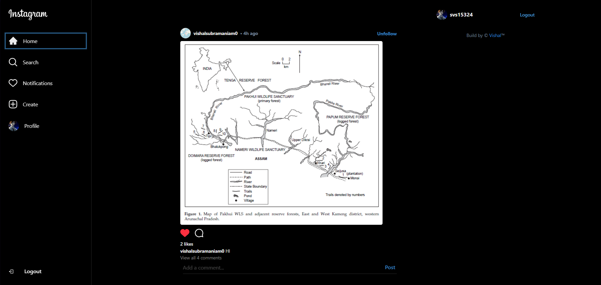
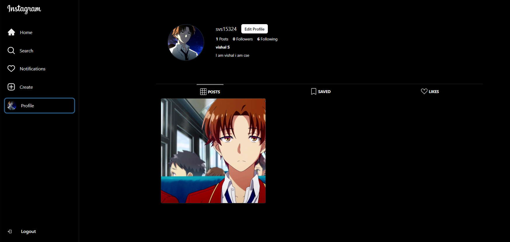

# Fun-Gram

Fun-Gram is a fully functional Instagram clone application built using modern web development technologies. This project demonstrates how to create a scalable and interactive social media application with a clean and responsive user interface.

## Features

- **User Authentication**: Secure login and signup functionality powered by Firebase Authentication.
- **Post Creation**: Users can create posts with images and captions.
- **Like and Comment**: Engage with posts by liking and commenting.
- **Real-time Updates**: Experience seamless real-time updates using Firebase Firestore.
- **User Profiles**: View and edit user profiles, including a profile picture and bio.
- **Responsive Design**: Optimized for both desktop and mobile devices using Chakra UI.

## Technologies Used

- **Frontend**: [Vite](https://vitejs.dev/) + [React](https://reactjs.org/)
- **UI Library**: [Chakra UI](https://chakra-ui.com/)
- **Backend**: [Firebase](https://firebase.google.com/)
  - Firebase Authentication
  - Firebase Firestore
  - Firebase Storage
- **Hosting**: Firebase Hosting

## Getting Started

Follow the steps below to set up the project on your local machine.

### Prerequisites

- Node.js (v16 or later)
- npm or yarn
- Firebase account

### Installation

1. Clone the repository:
   ```bash
   git clone https://github.com/vishals25/fun-gram.git
   cd fun-gram
   ```

2. Install dependencies:
   ```bash
   npm install
   ```
   or
   ```bash
   yarn install
   ```

3. Create a Firebase project:
   - Go to the [Firebase Console](https://console.firebase.google.com/).
   - Create a new project and enable Authentication, Firestore, and Storage.

4. Configure Firebase:
   - Copy your Firebase configuration from the Firebase Console.
   - Create a `.env` file in the root directory and add the following:
     ```env
     VITE_FIREBASE_API_KEY=your_api_key
     VITE_FIREBASE_AUTH_DOMAIN=your_auth_domain
     VITE_FIREBASE_PROJECT_ID=your_project_id
     VITE_FIREBASE_STORAGE_BUCKET=your_storage_bucket
     VITE_FIREBASE_MESSAGING_SENDER_ID=your_messaging_sender_id
     VITE_FIREBASE_APP_ID=your_app_id
     ```

5. Start the development server:
   ```bash
   npm run dev
   ```
   or
   ```bash
   yarn dev
   ```

6. Open your browser and navigate to:
   ```
   http://localhost:5173
   ```

## Deployment

To deploy the application to Firebase Hosting:

1. Build the application:
   ```bash
   npm run build
   ```
   or
   ```bash
   yarn build
   ```

2. Install the Firebase CLI:
   ```bash
   npm install -g firebase-tools
   ```

3. Log in to Firebase:
   ```bash
   firebase login
   ```

4. Initialize Firebase Hosting:
   ```bash
   firebase init hosting
   ```

5. Deploy to Firebase:
   ```bash
   firebase deploy
   ```

## Folder Structure

```
fun-gram/
├── public/              # Static assets
├── src/
│   ├── components/      # Reusable UI components
│   ├── pages/           # Application pages (Home, Profile, etc.)
│   ├── hooks/           # Custom React hooks
│   ├── Layout/          # Layout providers
│   ├── utils/        # Firebase service functions
│   ├── styles/          # Global and theme styles
│   └── App.jsx          # Main app component
├── .env                 # Environment variables
├── vite.config.js       # Vite configuration
├── package.json         # Dependencies and scripts
└── README.md            # Project documentation
```

## Screenshots

## Home Page


## Profile Page


## Contributing

Contributions are welcome! If you have suggestions for improvements or find a bug, feel free to open an issue or submit a pull request.

## Acknowledgements

- [Vite](https://vitejs.dev/)
- [React](https://reactjs.org/)
- [Chakra UI](https://chakra-ui.com/)
- [Firebase](https://firebase.google.com/)
